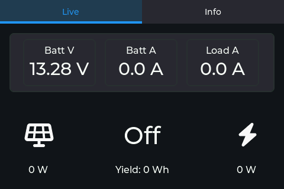
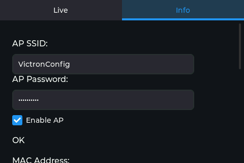
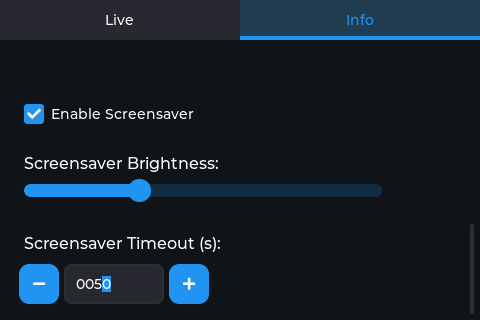
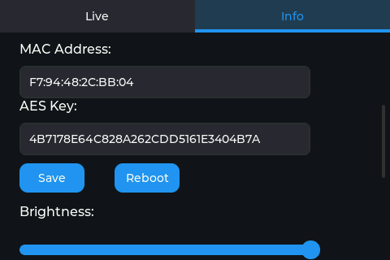
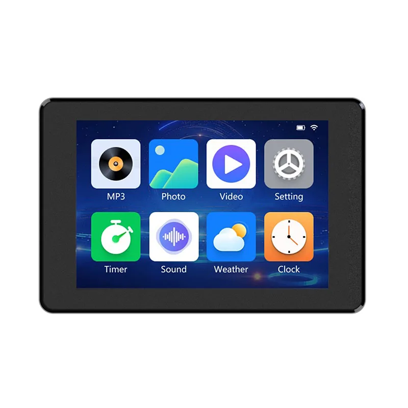
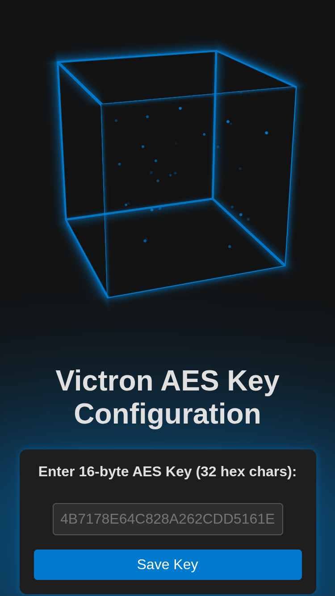

# VictronSolarDisplayEsp

An ESP32-S3-based solar panel monitor that displays real-time data from a Victron BLE panel using LVGL, and includes a built-in Wi‑Fi AP configuration server to set the AES encryption key via a user-friendly web interface or directly on the device.

**Works with Victron SmartSolar devices that have Bluetooth, including SmartSolar MPPT 75/10, 75/15, 100/15, and 100/20 solar chargers.**

---
## Screenshots

Below are screenshots of the device UI, showing both the Live tab and various Info tab configuration screens:

<p align="center">
  
  <br/>
  <b>Live Tab:</b> Shows real-time Victron data including battery voltage, current, load, solar yield, and system state.
</p>

<p align="center">
  
  <br/>
  <b>Info Tab – AP Config:</b> Configure the Wi-Fi AP SSID, password, and enable/disable the access point.
</p>

<p align="center">
  
  <br/>
  <b>Info Tab – Screensaver:</b> Adjust screensaver enable, brightness, and timeout settings.
</p>

<p align="center">
  
  <br/>
  <b>Info Tab – MAC & AES Key:</b> View and edit the AES key and see the current BLE MAC address. Save or reboot from here.
</p>

---
## Features

- **BLE Decryption & Display**
  - Scans Victron BLE advertisements, decrypts them with a user-configurable 128‑bit AES key, and parses output voltage, current, solar input, and yield.
  - Displays live data on a 320x480 (rotated) LCD using LVGL and custom UI themes.
  - Shows device state and error codes with icons and text.
  - Displays the MAC address of the currently connected Victron BLE device.

- **On‑Device Configuration**
  - **Web Interface:** Creates a Wi‑Fi SoftAP (`VictronConfig`) on boot. Hosts a web page (SPIFFS) for entering a new AES key.
  - **On-Device UI:** The Info tab allows direct entry and saving of the AES key and displays the current key and BLE MAC address.
  - All configuration is stored persistently in NVS.

- **Persistent Storage**
  - AES key, Wi-Fi settings, and display brightness are stored in NVS.
  - Default AES key is used if none is set by the user.

---

## Hardware Requirements

<p align="center">
  
  <br/>
  <b>Guition JC3248W535 3.5"</b> ESP32-S3 capacitive touch display module (320×480)
</p>
---

## Project Structure

```
VictronSolarDisplayEsp/
├─ CMakeLists.txt           # Top-level, includes spiffs partition
├─ sdkconfig                # IDF configuration
├─ files/                   # Static web assets (SPIFFS)
│   ├─ index.html
│   ├─ style.css
│   ├─ favicon.ico
│   ├─ git-icon.svg
│   └─ js/
│      └─ jquery-3.7.1.js
└─ main/                    # ESP-IDF application
   ├─ CMakeLists.txt        # Component registration
   ├─ main.c                # app_main, LVGL init, start services
   ├─ config_server.c       # Wi-Fi AP + HTTP server for config
   ├─ victron_ble.c         # BLE scanning & AES decryption
   ├─ ui.c                  # LVGL UI definition and callbacks
   ├─ display.h/.c          # LCD BSP interaction
   ├─ config_storage.c      # NVS read/write for AES key, Wi-Fi, brightness
   └─ ...                   # Other headers & components
```

---

## Build & Flash

1. **Install ESP-IDF v5.4.1** and set up environment:

   ```bash
   . $HOME/esp/esp-idf/export.sh
   ```

2. **Prepare static assets**: edit `files/index.html`, `style.css`, add any assets under `files/`.

3. **Full clean & build**:

   ```bash
   idf.py fullclean build
   ```

4. **Flash firmware + partitions** (includes SPIFFS image):

   ```bash
   idf.py flash monitor
   ```

5. **Interact**:

   - On first boot, the device sets up a SoftAP `VictronConfig` (no password). Connect to it.
   - **Captive Portal:** When you connect with an Android or iPhone, a popup will automatically appear, directing you to the configuration page (index.html). This makes setup fast and easy—no need to manually enter the IP address!
   - You can also browse to [http://192.168.4.1/](http://192.168.4.1/) to configure the AES key via web UI.
   - Alternatively, use the Info tab on the device to enter and save the AES key.
   - After saving, the device reboots and begins displaying live BLE data.

---

## Framebuffer Screenshot Conversion

You can capture a raw framebuffer screenshot from the device and convert it to a PNG image using the provided Python script.

### 1. Download the raw framebuffer

Use `curl` to fetch the framebuffer from the device's HTTP endpoint (replace the IP if needed):

```bash
curl http://192.168.4.1/screenshot -o framebuffer.raw
```

### 2. Convert to PNG

Run the Python script to convert the raw framebuffer to a PNG image:

```bash
python convert_screenshot.py framebuffer.raw output.png
```

---

## Configuration

- **Default AES key (if none set):**  
  `4B7178E64C828A262CDD5161E3404B7A`
- **To change the AES key:**
  - Connect to the AP, enter a new 32-character hex string in the web UI, and click **Save**.
  - Or, use the Info tab on the device, enter the new key, and press **Save**.
- **Other settings:**
  - Wi-Fi SSID, password, and AP enable/disable can be configured from the Info tab.
  - Display brightness is adjustable and persists across reboots.

---

## Dependencies

- [ESP-IDF v5.4.1](https://docs.espressif.com/projects/esp-idf)
- [NimBLE](https://github.com/apache/mynewt-nimble)
- [LVGL](https://lvgl.io/) and Espressif LVGL port
- AES CTR mode from `esp_aes`

---

## Device UI (Info Tab)

- **AP SSID / Password:** Configure Wi-Fi AP settings.
- **Enable AP:** Checkbox to enable/disable the SoftAP.
- **Error:** Shows the latest error code from Victron BLE data.
- **MAC Address:** Shows the MAC address of the currently connected Victron BLE device.
- **AES Key:** Shows the current AES key. You can enter a new key and press **Save** to update.
- **Save / Reboot:** Save the AES key or reboot the device.
- **Brightness:** Adjust the display brightness (persists in NVS).

---

## AES Key Configuration via Captive Portal

On first boot (or after a reset), the device creates a Wi-Fi access point (`VictronConfig`) and launches a captive portal. When you connect with your phone or computer, a popup or redirect will automatically open the configuration page. Here you can securely enter or update the 16-byte AES key (32 hex characters) required for decrypting Victron BLE data.

<p align="center">
  
  <br/>
  <b>Captive Portal – AES Key Configuration:</b> Enter your 32-character AES key directly from your mobile device or computer. The interface is mobile-friendly and guides you through the process.
</p>

After saving the key, the device will reboot and begin displaying live data.

---

## License

This project is released under the MIT License. See `LICENSE` for details.
